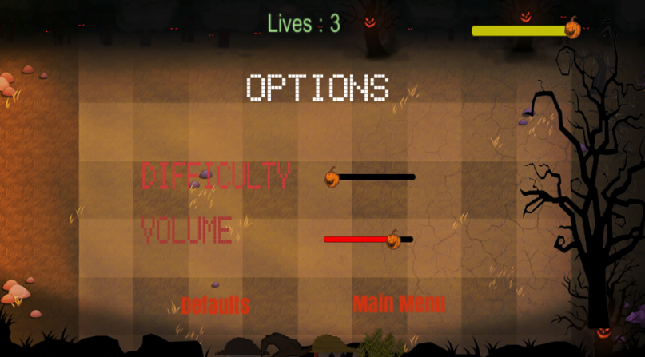

# School-Project-Awoken-Pumpkin

Abstract:
Our project is a classic, simple but effective videogame based on the videogame genre called “tower defense” and the main goal in the game is to spend time while waiting for something, such as waiting in public transport, waiting to meet someone at a place etc. While we keep the game simple so it can be used to play in short time intervals to spend time and relax, we added a little competitivity in it to be played with friends and compete with each other. But even though it can be a good game to be played competitively in larger sessions of gaming, it is going to serve much more fun to be played on smaller sessions. We knew there are many other videogames similar to what we created but we also know that it’s better for genres like this to have more variation, since monopoly for gaming means apocalypse. Our game is actually 2D but we designed it so it looks like it is a 3D game. The game has 5 levels and is made of traditional level system, so it gets harder on each level passed as it should be. We aimed the game to be played on all ages including the minority, so it doesn’t include anything inappropriate or NSFW such as blood, gore or nudity, and violence wise we kept it as less violent as possible. Our game shares similarities with the game “Plants vs. Zombies” but our game has a much different theme. The theme is farmers defending their ground against halloween monsters and ghosts. A similar theme to this was used in Pumpkin Moon Event in Terraria game, but never before in a tower defense game. 

While we did get inspired by both Terraria’s Pumpkin Moon Event and Plants vs Zombies, we kept our originality by creating our very own graphics for the game. The game also has a time limit for each level and when the time limit ends, the attackers stop attacking. The game has a currency called “wheat” and defenders can only be spawned if there is enough wheat. If all attackers are killed before the health bar is 0, the player proceeds to next level. If health bar reaches 0 before the attackers are killed, the level is lost. The health bar doesn’t decrase if the defenders die, but it decrases when the attackers pass the defenders and reach the farm, making the goal to focus on protecting only the farm. There are 3 attackers and 3 defenders in the game. The player can spawn 3 defenders and wheat, when wheat is spawned it grows after a while and can be harvested to add more wheat currency to player strategically. The attackers spawn at random places and random times, making the game harder and more unexpectable.

Methods Used in the Project:

We used Unity Game Development Kit and C# language while creating this software, and Adobe Photoshop for its graphics (sprites, models and animations) We also used Unity to turn models into animatios. We used C# method IEnumerator to delay the spawns of the attackers. Scripts are done in Unity. General OOP technics has been used a lot in the application, there are aroun 20 classes in the code. Unity Lifecycles have been also used.
Project Details
 

A: Main Menu 
It has 3 buttons: Start Game, Options, Exit. Start Game simply starts the game from first level. Options button opens the options menu and exit game closes the application. Menu is also accessible from pause menu or after finishing the game on the credits screen.

 
B: Main Options 
Accessible from main menu only, it lets the player set the volume and difficulty of the game. Each of those have one bar. It has a back button to return main menu. Difficulty sets the quantity and frequency of attacker spawn. Defaults button sets all settings to default.
 

C: The Game 

The game as mentioned in the abstract part has 5 levels, each level being harder than the previous one. All defenders and wheat are usable since the first level but only 2 out of 3 types of attackers are available at level 1. After level 2, all attacker types begin attacking. 3 types of defenders are Farmer Mage, Melee Farmer and Muskeeter Farmer. Mages and Muskeeters do long ranged attacks while Melee Farmer has only 1 range. The Mage creates and throws fireballs at the attackers. The muskeeter, as the name leads, has a musket which he fires it at the attackers. Melee farmer has a pitchfork and he hits the attackers with it at point blank range. All defenders have different health. Melee Farmer has 100, Muskeeter has 200 and Mage has 250. They also deal different amounts of damage; Melee Farmer deals 20 damage, Muskeeter Farmer deals 30 damage and Farmer Mage deals the most damage of 40, therefore we made the wheat costs of the farmers according to it. The player can also place wheats into the place for 70 wheat cost, and harvest it for 40 wheat each time it’s harvest time comes. That makes it strategically important for wheat, it’s also the only way to get more wheat than the wheat given at the beginning of level. The attackers are Ghosty (a floating ghost with arms), Zombkin (a walking zombie) and Hound (a running hell hound). Ghosty and Zombkin attack from level 1 but Hound is only available after level 2. This was decided like this because the speed of Hound is much faster than Ghosty and Zombkin, since it’s running. After each level, the amount of wheat given to the player increases as well as the amount and frequency of enemy spawn, making the fight more fair but more challenging. But still in all levels, the frequency of the attacker spawn is completely random, making the game stay always unexpectable. Zombkin and Ghosty use their arms to attack while Hound uses a bite animation to attack.
As it can be seen from the ingame screenshot below, the time bar is on top right, farm health is on middle top, wheat amount is on bottom left and defender/wheat spawn tabs are on bottom middle. When the wheat amount is 0, the player cannot spawn any defenders or harvestable wheat. When the farm health is 0, the game is lost. When the timer expires the attackers stop spawning, however rest of the attackers need to be eliminated in order for the level to be won. As it can be seen, the background of the game and all the details such as the trees, pumpkins and cracked dark yellow ground are halloween-related, so that the feel of halloween is fully injected into the atmosphere of the game. 
 
D: ESC Pause Options Menu

Accessible by hitting ESC while in-game. Player is able to edit volume and difficulty from this menu, as well as go back to main menu in case they want to exit the game. Defaults button sets the options back to default.
 

E: Credits Screen

Available after all 5 levels of the game are finished, it automatically pops up after level last is completed. It has a button to return to main menu. 

Literature Review:
People in the history always needed to have fun to not get bored in different ways since the beginning of history. Be it by playing different kinds of games, making music or else. The Word “fun” comes from 15th century English language which first meant “foolish” or “silly” [1]. In today’s World, fun means enjoyment, amusement, or lighthearted pleasure [2]. A “game” is called a form of play or sport, especially a competitive one played according to rules and decided by skill, strength, or luck [3]. In October 1958, Physicist William Higinbotham created what is thought to be the first video game [4]. While this videogame was too far from what games we play today, it kickstarted it all. Today, there are thousands of videogames. And maybe hundreads of them are in tower defense genre. In this review we will show how our game is more different and/or similar than the other games of the genre.
Let the first example be Rampart. Developed and released by Atari Games in 1990, Rampart is regarded as the first game that fits the Tower Defense Game Genre [5]. However Rampart is much different than our game, and even though it’s considered a tower defense game, it almost has no similarities with our game. Developed by Paul Preece in 2007, Desktop Tower Defense is widely considered as the game that launched the genre of Tower Defense games into the mainstream [6]. Desktop Tower Defense has similarities with our game such as stopping and slowing down the attackers by putting towers on the gameplay area, however in Desktop Tower Defense the attackers move both up-down and left-right while in our game the attackers only move left because that’s the place they have to attack. Also our game doesn’t have towers even though it’s a tower defense game, but instead defenders. In 2009, PopCap Games released Plants vs. Zombies for Mac OSX and Microsoft Windows [7]. Plants vs Zombies series probably is the game that shares most similarities with our game, since undeniably we took inspirations from it. In both Plants vs Zombies and our game the attackers move only one way and are stopped by the defenders placed on the play area, and there are both ranged and melee defenders while all attackers are limited to melee. While there are differences between our game and Plants vs Zombies, such as the time limit in our game and the plantable wheat, and obviously our theme is much different than Plants vs Zombies. What we tried to create was to make a game like Plants vs Zombies which has a different theme and can be played in small time intervals without needing to launch a big game and we think we achieved it. Our game is small, fast, can be ran in lowest end computers of 2019 and it has an original theme. 
